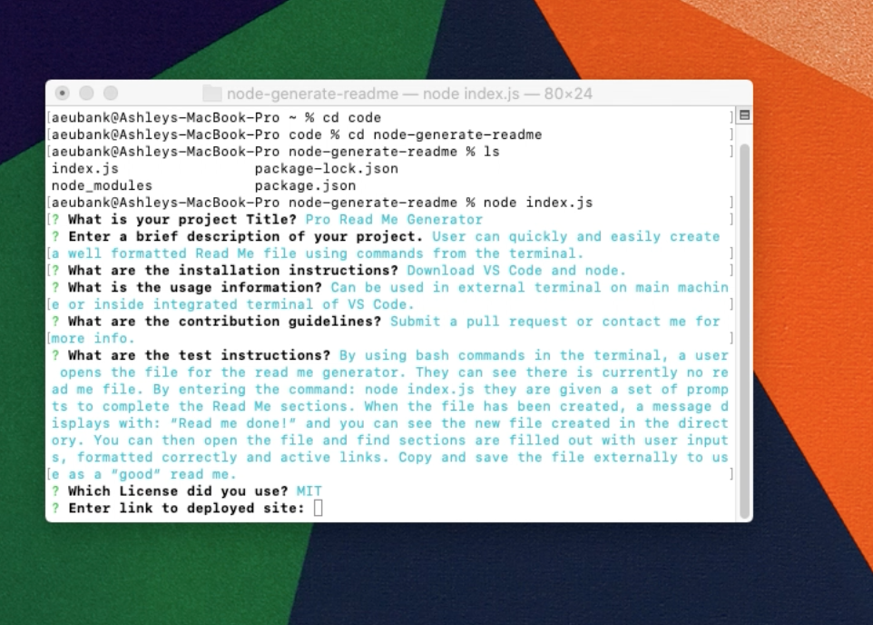

# Employee Finder  

## Table of Contents:
* [Description](#Description)
* [Installation](##installation)
* [Usage](##usage)
* [Contribution Guidelines](##contribution)
* [Testing](##test)
* [License](##license)
* [Links](##links)
* [FAQs](##Questions)

## Description:
User can view, sort and search a list of employees.

## Installation:
Have an internet connection.

## Usage:
Go to the website url. Employees will randomly generate on page load. Click on First Name, Last Name or Location to sort alphabetically, or type into the search bar to find someone specific. 

## Contribution:
Submit a pull request or email me directly.

## Test:
Open website and click headers to sort. Type into search input to filter.

## License:
The MIT License 
Permission is hereby granted, free of charge, to any person obtaining a copy of this software and associated documentation files (the "Software"), to deal in the Software without restriction, including without limitation the rights to use, copy, modify, merge, publish, distribute, sublicense, and/or sell copies of the Software, and to permit persons to whom the Software is furnished to do so, subject to the following conditions:

The above copyright notice and this permission notice shall be included in all copies or substantial portions of the Software.

THE SOFTWARE IS PROVIDED "AS IS", WITHOUT WARRANTY OF ANY KIND, EXPRESS OR IMPLIED, INCLUDING BUT NOT LIMITED TO THE WARRANTIES OF MERCHANTABILITY, FITNESS FOR A PARTICULAR PURPOSE AND NONINFRINGEMENT. IN NO EVENT SHALL THE AUTHORS OR COPYRIGHT HOLDERS BE LIABLE FOR ANY CLAIM, DAMAGES OR OTHER LIABILITY, WHETHER IN AN ACTION OF CONTRACT, TORT OR OTHERWISE, ARISING FROM, OUT OF OR IN CONNECTION WITH THE SOFTWARE OR THE USE OR OTHER DEALINGS IN THE SOFTWARE.

## Links:
[Deployed Site/Related Links](https://finding-employees.herokuapp.com/)

## Questions?
Contact me through Github:
[Git Hub](https://github.com/eubank87)
Or send an email to: eubank.ashley@gmail.com
    